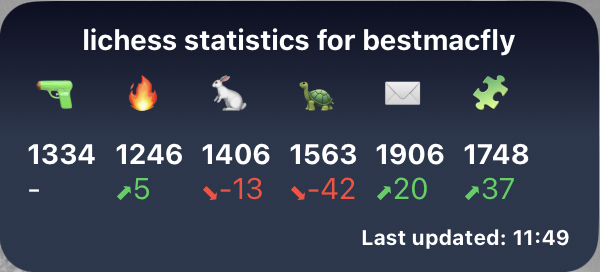

# Sriptable-Lichess-Widget
A Scriptable widget that shows your Lichess statistics

## Features
This widget shows your current lichess rating for 
- Bullet
- Blitz
- Rapid
- Classic
- Puzzles

For each rating, in addition the change of your rating between the last two days played is shown.
If you tab on the widget, you will be redirected to lichess.org.

Note: The widget only supports medium size.

## Installation

1. At first, install [Scriptable](https://apps.apple.com/de/app/scriptable/id1405459188)
2. Click the "+"-Icon in the Scriptable-app.
3. Copy all the text from the Lichess.js-file. Click [here](https://github.com/bestmacfly/Scriptable-lichess-Widget/blob/main/Lichess.js)  to get to the file.
4. If you don't want to see all possible stats, just disable everything you don't want to see by adjusting the array in line 2. For example, if you don't need bullet, it would look like this:
				
				var gameTypes={
  					Bullet:false,
  					Blitz:true,
  					Rapid:true,
  					Classical:true,
  					Correspondence:true,
  					Puzzles:true
				}

5. Add a Scriptable-widget to your homescreen.
   * Add it with size "medium".
   * Make sure to choose "Open app" for "When Interacting".
   * As parameter enter your lichess username
